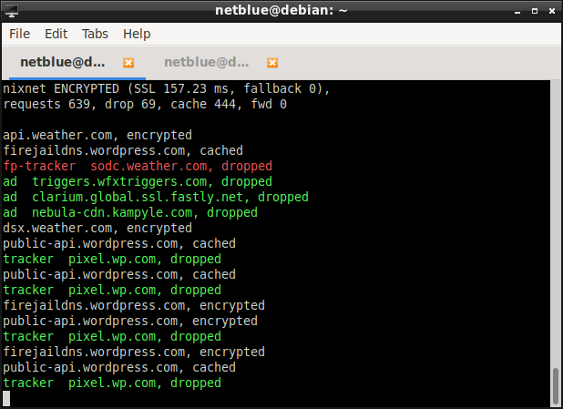

# Firejail DNS-over-HTTPS Proxy Server

fdns is a DNS-over-HTTPS proxy server targeted at small networks and Linux desktops.
To speed up the name resolution fdns caches the responses, and uses a configurable adblocker
and privacy filter to cut down unnecessary traffic.
The software is written in C, and is licensed under GPLv3.

<div style="height:20px;">&nbsp;</div>

## Technology

[DNS-over-HTTPS](https://en.wikipedia.org/wiki/DNS_over_HTTPS) (DoH)
enhances user privacy and security by authenticating and
encrypting DNS traffic between the client computer and the DNS server.
It thus prevents eavesdropping and man-in-the-middle attacks.
The authentication and encryption is deferred to HTTPS, a mature, widespread technology.
As a user, you don't have to mess around with SSL/TLS certificates, encryption keys and whatnot.
The certificates are already installed on your computer for your browser.

<div style="height:20px;">&nbsp;</div>

## Project Status

Release 0.9.62 is out. Download: https://github.com/netblue30/fdns/releases/tag/v0.9.62.

The current development version is 0.9.63.


<div style="height:20px;">&nbsp;</div>

## Features

* Works out of the box with no configuration changes.
The defaults mentioned below can be overwritten using command line options.

* The proxy listens on local loopback address 127.1.1.1, UDP port 53.
This allows it to coexist peacefully with any other DNS server/proxy installed on the system.
Change this default with --proxy-addr command line option.

* Using only DoH services from zero-logging providers, based on the privacy policy
posted on the provider's website. Print the list of supported servers with --list, 
and use --server= to pick up a specific server (--server=powerdns). You can also use a group,
in this case fdns will chose a random server from the group (--server=Europe). By default
we pick up a random server from anycast group (--server=anycast).
`````
$ fdns --list
42l - non-profit, France, Europe
	https://42l.fr
adguard - anycast, adblocker
	https://adguard.com/en/adguard-dns/overview.html
appliedprivacy - non-profit, Austria, Europe
	https://appliedprivacy.net
cleanbrowsing - anycast, security
	https://cleanbrowsing.org
cleanbrowsing-family - family
	https://cleanbrowsing.org
cloudflare - anycast
	https://www.cloudflare.com
digital-society - non-profit, Switzerland, Europe
	 https://www.digitale-gesellschaft.ch
powerdns - Netherlands, Europe
	https://powerdns.org
quad9 - anycast, security
	https://quad9.net
seby.io - Australia, Asia-Pacific
	https://dns.seby.io
tiarapp - Singapore, Asia-Pacific
	https://doh.tiar.app
tiarapp-jp - Japan, Asia-Pacific
	https://jp.tiar.app/
`````

* DNS resolver cache with a fixed time to live of 180 seconds for DNS records.

* Default anti-tracker and adblocker based on EFF's [Privacy Badger](https://github.com/EFForg/privacybadger)
and Steven Black's [hosts](https://github.com/StevenBlack/hosts) project.
For blocked domains we respond with 127.0.0.1. Use --nofilter to disable.

  The filter files are /etc/fdns/adblocker and /etc/fdns/trackers.
These are regular text file, you can modify them, or even delete them.
You can also add your own list in /etc/fdns/hosts.
Adblocker hosts files as published all over the net should work just fine.

* Blocking IPv6 requests by default and responding with NXDOMAIN.
Use --ipv6 option to overwrite the default.

* DNS handles multiple categories of data: name resolution, email, internet telephony etc.
By default fdns forwards only domain name resolution queries A (and AAAA if --ipv6 is requested).
All other queries are dropped, NXDOMAIN is returned.
Disable this functionality with --allow-all-queries if you are running an email server or some
other service that requires special DNS handling.

* Regular DNS over UDP fallback in case DoH service is unavailable. We use Quad9 for fallback.

* Live DNS request monitoring and statistics.

* Highly scalable multi-process design with a monitoring process and several independent worker processes.
The workers are chrooted into an empty filesystem and sandboxed
in separate Linux namespaces. The privileges are dropped, and
a whitelist seccomp filter is enabled. By default we start 3 workers.
An AppArmor profile is installed in /etc/apparmor.d directory.

* Seamless integration with [Firejail security sandbox](https://github.com/netblue30/firejail),
a graphical user interface if available in [Firetools](https://github.com/netblue30/firetools).

<div style="height:20px;">&nbsp;</div>

## Software compile and install

Dependencies: OpenSSL library and libseccomp.

* Debian/Ubuntu: sudo apt-get install libseccomp-dev libssl-dev

* Fedora/CentOS: sudo yum install libseccomp-devel openssl-devel

* Arch Linux: the libraries are already included in the base group

`````
$ git clone https://github.com/netblue30/fdns
$ cd fdns
$ ./configure --prefix=/usr
$ make
$ sudo make install
`````
If AppArmor is present in the system, enable fdns profile by running
`````
# /sbin/apparmor_parser -r /etc/apparmor.d/usr.bin.fdns
`````

<div style="height:20px;">&nbsp;</div>

## Setup fdns on a workstation

Use [Firejail security sandbox](https://github.com/netblue30/firejaill)
to redirect all the DNS traffic to 127.1.1.1, where fdns listens by default.
Firejail decouples the DNS functionality, allowing each sandbox to  have its own DNS setting.
Your system DNS configuration is not touched. If things go wrong, you won't lose your Internet connectivity.
Here are the steps:

 * Start fdns:
`````
$ sudo fdns
`````

 * Start your applications in Firejail:
`````
$ firejail --dns=127.1.1.1 firefox
$ firejail --dns=127.1.1.1 transmission-qt
`````
<div style="height:20px;">&nbsp;</div>

## Setup fdns on a network server

Set "nameserver 127.0.0.1" in /etc/resolv.conf.
Start fdns using --proxy-addr-any. The proxy will listen on all system interfaces, and 127.0.0.1 for loopback interface.
The default 127.1.1.1 is not used in this case, Firejail is not required to be installed on the system.
`````
$ sudo fdns --proxy-addr-any --daemonize
`````
You can also run the server only on a specific network interface. Example assuming 192.168.1.44 is the IP address of eth0:
`````
$ sudo fdns --proxy-addr=192.168.1.44 --daemonize
`````
When using --daemonize, errors and warnings are posted to syslog (/var/log/syslog on most systems).

<div style="height:20px;">&nbsp;</div>

## Monitoring the proxy

To monitor fdns, run as a regular user
`````
$ fdns --monitor
`````


The connection status (encrypted/not encrypted) and the requests are posted live in the monitor.

<div style="height:20px;">&nbsp;</div>

## FAQ:

### Technology

#### Is DoH slower than regular DNS?

According to [Mozilla](https://blog.mozilla.org/futurereleases/2019/04/02/dns-over-https-doh-update-recent-testing-results-and-next-steps/) the impact is minimal. The slowest Internet connection I got a chance to test fdns on was a standard 864 kbps  DSL. There was no visible difference while browsing.

#### Is the fallback mode really necessary?

In my experience it is. HTTPS connections open long periods of time tend to misbehave,
not to mention if it starts raining.

To give you an idea, on a typical day on Cloudflare the monitor reports about 5000 encrypted request, with 8 requests sent in clear (fallback mode). Problems appear when you take the computer out of sleep mode. Depending how long the computer was sleeping, it could take a few seconds to detect the errors and reestablish the HTTPS connection. During this time, the fallback mode kicks in.

#### If I use fdns, do I still need an adblocker?

Yes, the more the merrier! You can also pick up a DoH provider like CleanBrowsing or Quad9 that does additional security filtering (malware, attack sites, etc).

<div style="height:10px;">&nbsp;</div>

### DevOps

#### How do I start fdns when I power-on the computer?

One solution that will work on any Linux computer is to start it from /etc/rc.local.
`````
$ cat /etc/rc.local
#!/bin/sh -e

/usr/bin/fdns --daemonize
exit 0
`````
For systemd users, we place a fdns.service file in /etc/fdns directory. 

#### How do I configure Firejail to send all the DNS traffic to fdns by default?

As root user, add the following two lines in /etc/firejail/golbals.local. If the file doesn't exist, create it:
`````
$ cat /etc/firejail/globals.local
dns 127.1.1.1
ignore dns
``````

#### How do I save a list with all the DNS requests?

Start fdns this way:
`````
$ sudo fdns | tee dnslist.txt
`````

#### How do I check fdns is running in the background?

Run ss and look for sockets open on port 53:
`````
$ sudo ss -nulp
State     Recv-Q    Send-Q       Local Address:Port        Peer Address:Port
[...]
UNCONN    0         0                127.1.1.1:53               0.0.0.0:*        users:(("fdns",pid=4227,fd=11))
UNCONN    0         0                127.1.1.1:53               0.0.0.0:*        users:(("fdns",pid=4226,fd=9))
UNCONN    0         0                127.1.1.1:53               0.0.0.0:*        users:(("fdns",pid=4225,fd=7))
`````
In the default case you get 3 worker processes listening on 127.1.1.1 port 53. Or you can use a more traditional
`````
# ps ax | grep fdns
 1069 ?        Ss     0:00 /usr/bin/fdns --daemonize --server=anycast
 1072 ?        S      0:00 /usr/bin/fdns --id=0 --fd=6 --server=adguard
 1073 ?        S      0:00 /usr/bin/fdns --id=1 --fd=8 --server=adguard
 1074 ?        S      0:00 /usr/bin/fdns --id=2 --fd=10 --server=adguard
`````

#### How do I shut down fdns?
`````
$ sudo pkill fdns
`````

<div style="height:20px;">&nbsp;</div>
